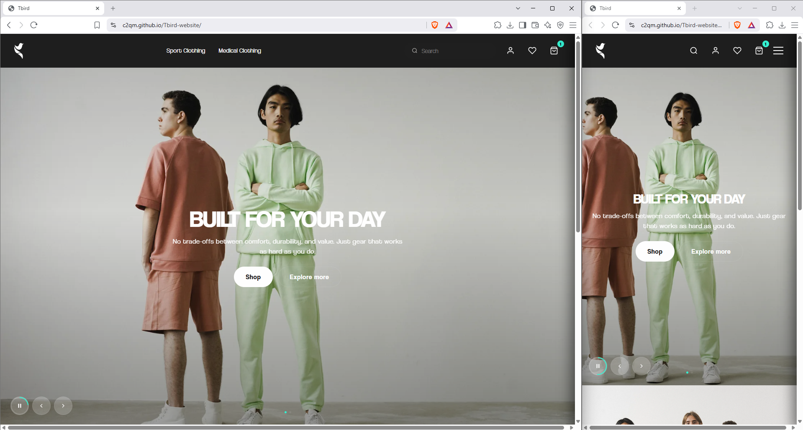
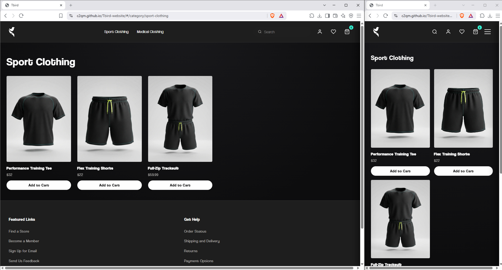
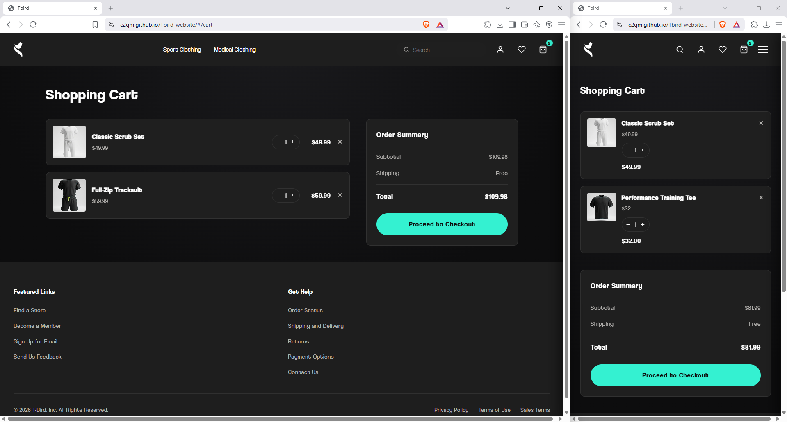

# Tbird Website
Tbird is a modern, responsive e-commerce web application designed for sports and medical apparel.

## About This Project
I built Tbird to explore what a clean, modern e-commerce experience for sports and medical apparel could feel like. I designed the full visual identity and brand guideline myself, colors, typography, and logo usage, then applied it across the site to keep the shopping experience simple, easy to use, and clear. This project let me explore component-based architecture and design systems in a web context, from an autoplay hero slider to a mega-menu navbar.

## Screenshots
| Home | Products | Product Detail |
|---|---|---|
|  |  |  |

## Link
https://c2qm.github.io/Tbird-website/

## Tech Stack
 * React
 * TypeScript
 * CSS

## Features
 * Hero slider with autoplay, manual navigation, and dot indicators.
 * Split banner sections for featured products and collections.
 * Responsive navbar with mega menu, search panel, and category navigation.
 * Custom design system built around the TBird brand identity (colors, typography, logo usage).
 * Simple, easy-to-use, and clear interface.

## Technical Details
 * Component-based architecture: each UI section (Navbar, Hero, SplitBanner, Sidebar, etc.) has its own component and stylesheet.
 * CSS variables used throughout for theme consistency.
 * Status: in progress, homepage and core components are complete, remaining pages are under development.